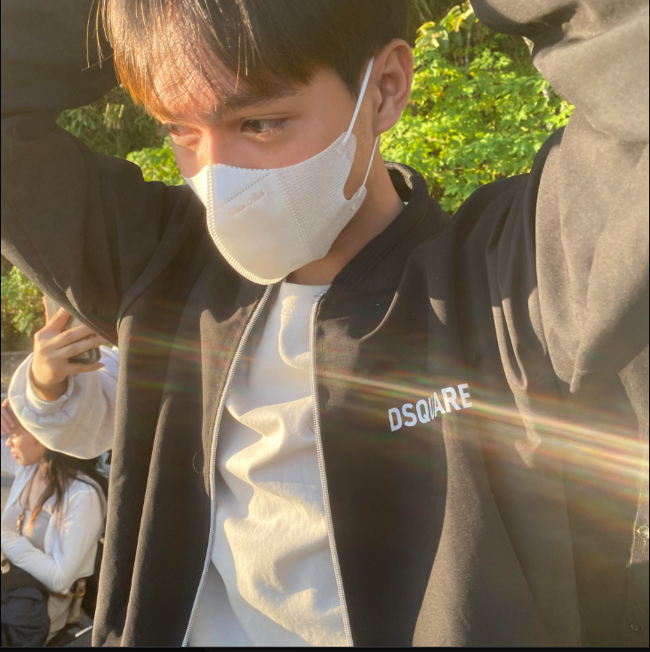

  

 

  

   

  

 

<table>
<tr>

<td>

</td>

<td>

</td>

</tr>
</table>

<table>
  <tr>
    <td width="25%">
      
    </td>
    <td align="center">
      🎓 <b>Information Technology Student</b> 
      <i>( Sinh viên Công nghệ Thông tin )</i> 
      🤖 <b>Passionate about Artificial Intelligence</b> 
      <i>( Đam mê Trí tuệ nhân tạo )</i> 
      💻 <b>Building Full-Stack Applications</b> 
      <i>( Xây dựng các ứng dụng Full-Stack )</i> 
      ⚡ <b>Developing Embedded Systems</b> 
      <i>( Phát triển hệ thống nhúng )</i> 
      🌱 <b>Always Learning & Building</b> 
      <i>( Không ngừng học hỏi và sáng tạo )</i>
    </td>
    <td width="25%">
      
    </td>
  </tr>
</table>

<h1>🌟 Current Focus 🌟</h1>

  
  
  
  
  
                            

<H1>🤝 Connect with Me 🤝</H1>

      

<h1>🐍 green-square-muncher 🐍</h1>

  

